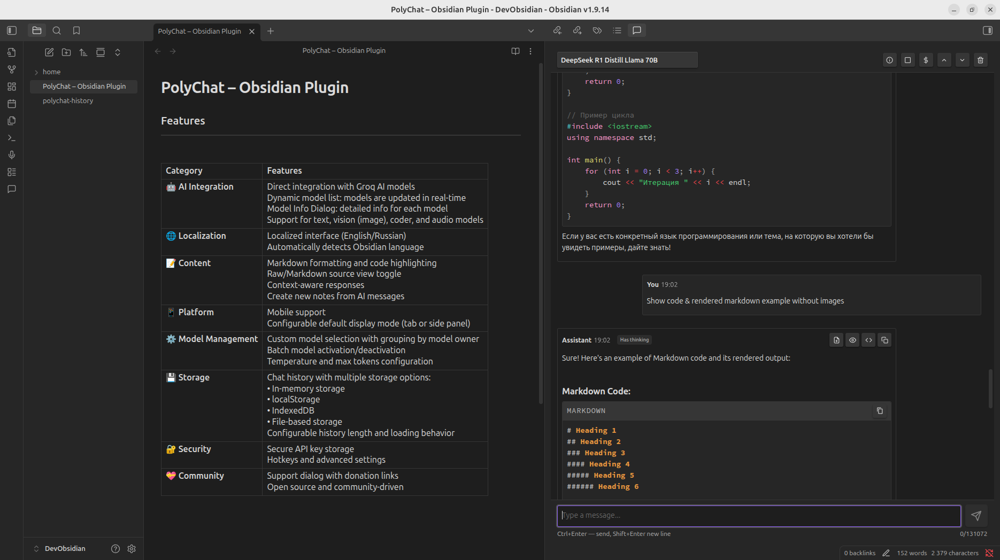
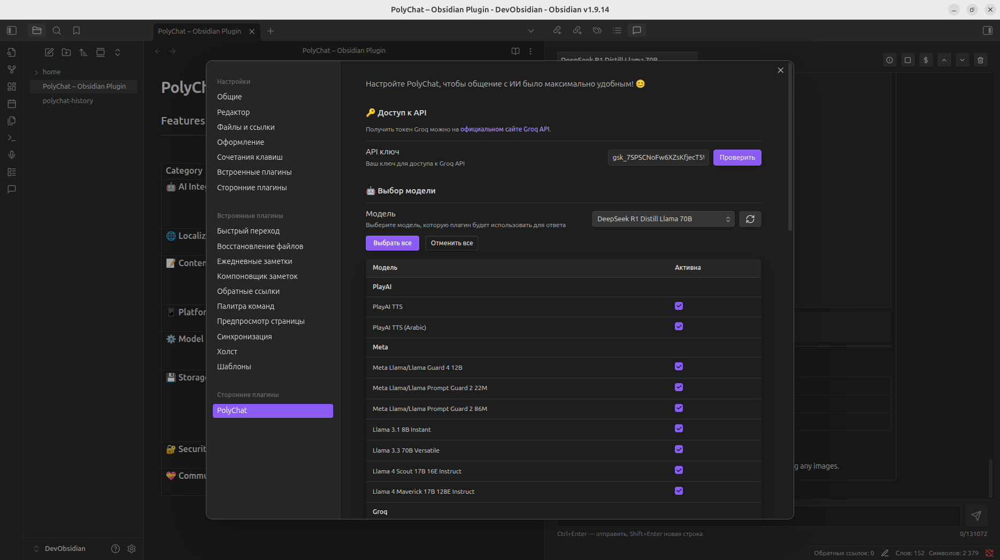

# PolyMind — Плагин для Obsidian

[](https://github.com/semernyakov/polymind/releases/latest)
[](https://github.com/semernyakov/polymind/releases)
[](LICENSE)
[](https://github.com/semernyakov/polymind/actions/workflows/ci.yml)
[](https://www.npmjs.com/package/polymind)
[](CODE_OF_CONDUCT.md)

<!-- [](https://codecov.io/gh/semernyakov/groq-chat-plugin) -->

[English version](../README.md)

PolyMind для **Obsidian** — локальный чат-плагин для **Groq AI** с поддержкой обновления моделей в реальном времени. Он хранит историю общения, работает с Markdown, помогает управлять контекстом заметок и настройками интерфейса.

> В текущей версии поддерживается только провайдер **Groq**. **OpenRouter** пока не включён, но добавление второго провайдера запланировано на будущие релизы.

## Скриншоты

**Основной интерфейс**



**Интерфейс настроек**



## Возможности

| Категория                  | Возможности                                                                                                                                                                                                                                                                        |
| -------------------------- | ---------------------------------------------------------------------------------------------------------------------------------------------------------------------------------------------------------------------------------------------------------------------------------- |
| **🤖 AI Интеграция**       | Прямая интеграция с моделями Groq AI<br>Динамический список моделей: модели обновляются в реальном времени<br>Кнопка обновления списка моделей<br>Диалоговое окно модели: подробная информация о каждой модели<br>Текущий фокус: текстовые и code-чаты |
| **🌐 Локализация**         | Локализация интерфейса (русский/английский)<br>Автоматически определяет язык Obsidian                                                                                                                                                                                              |
| **📝 Контент**             | Поддержка форматирования Markdown и подсветка кода<br>Переключатель просмотра Raw/Markdown<br>Контекстно-зависимые ответы<br>Создание новых заметок из сообщений AI                                                                                                                |
| **📱 Платформа**           | Поддержка мобильных устройств<br>Настраиваемый режим отображения по умолчанию (вкладка или боковая панель)                                                                                                                                                                         |
| **⚙️ Управление моделями** | Выбор пользовательских моделей с группировкой по владельцам<br>Массовая активация/деактивация моделей<br>Настройка температуры и максимального количества токенов                                                                                                                  |
| **💾 Хранение**            | История чата с несколькими вариантами хранения:<br>• Хранение в памяти<br>• localStorage<br>• IndexedDB<br>• Хранение в файле<br>Настраиваемая длина истории и поведение загрузки                                                                                                  |
| **🔐 Безопасность**        | Безопасное хранение API ключа<br>Горячие клавиши и расширенные настройки                                                                                                                                                                                                           |
| **💝 Сообщество**          | Диалог поддержки со ссылками на донаты<br>Открытый исходный код и поддержка сообщества                                                                                                                                                                                             |

## Статус проекта

Этот проект активно поддерживается и развивается. Текущая реализация сфокусирована на текстовых и code-чата через Groq API, обогащении контекста заметок и управлении историей. Работа с изображениями и аудио в текущем релизе не поддерживается, а соответствующие возможности остаются в разработке.

### Текущее состояние поддержки моделей

На текущий момент PolyMind в первую очередь ориентирован на текстовые модели и workflow для работы с кодом. Плагин намеренно фильтрует не-чатовые записи, такие как модели для изображений и аудио, потому что эти multimodal-функции в текущей реализации не поддерживаются.

Плагин не хранит фиксированный список моделей внутри кода. Вместо этого он запрашивает актуальный каталог моделей у провайдера во время работы и обновляет список в настройках.

Это означает:

- список моделей может меняться без релиза плагина
- новые модели появляются после обновления списка
- некоторые модели могут быть временно недоступны или скрыты провайдером
- multimodal-модели (изображения/аудио) в текущем релизе не поддерживаются даже если провайдер их предоставляет
- итоговый список в приложении всегда является источником истины, а не статическая таблица в README

### Доступность моделей

Плагин не хранит фиксированный список моделей внутри кода. Вместо этого он запрашивает актуальный каталог моделей у провайдера во время работы и обновляет список в настройках.

Это означает:

- список моделей может меняться без релиза плагина
- новые модели появляются после обновления списка
- некоторые модели могут быть временно недоступны или скрыты провайдером
- итоговый список в приложении всегда является источником истины, а не статическая таблица в README

Чтобы обновить список, откройте настройки плагина и нажмите кнопку обновления моделей. В интерфейсе модели группируются по владельцам и отфильтровываются неподходящие для чата записи, такие как speech, image и audio модели.

> Текущий релиз поддерживает только текстовые модели. Поддержка изображений и аудио находится в разработке, а добавление ещё одного провайдера запланировано на будущие релизы.

## Установка

1. Откройте настройки Obsidian
2. Перейдите в раздел Community Plugins и отключите безопасный режим
3. Нажмите "Обзор" и найдите "PolyMind"
4. Установите плагин
5. Включите плагин в разделе Community Plugins

## Настройка

1. Получите API ключ на [Groq Console](https://console.groq.com)
2. Откройте настройки плагина в Obsidian
3. Введите ваш API ключ
4. Настройте дополнительные параметры по необходимости (Примечание: Настройки были обновлены, включая опции для режима отображения по умолчанию и хранения истории. Подробности см. в настройках плагина.)

### Как работает обновление моделей

Плагин не хранит статический список моделей в коде. Вместо этого он запрашивает актуальный каталог моделей у Groq при необходимости и обновляет список в настройках.

Типичный сценарий:

1. Откройте настройки плагина.
2. Нажмите кнопку обновления рядом с выбором модели.
3. Приложение вызывает API провайдера и загружает актуальный список моделей.
4. Интерфейс группирует модели по владельцам и отфильтровывает неподходящие для чата записи.
5. Выбранная модель сохраняется в настройках плагина.

Поскольку список строится провайдером, доступность моделей может меняться без нового релиза плагина. Если модель исчезла, была переименована или временно недоступна, следующее обновление списка исправит это автоматически.

## Использование

1. Откройте любую заметку
2. Нажмите на иконку PolyMind в боковой панели
3. Начните общение с AI
4. Используйте команды с `/` для дополнительных функций **(не реализовано!)**

## Тестирование плагина через BRAT

Вы можете установить и протестировать последнюю версию плагина из репозитория с помощью плагина [BRAT](https://github.com/TfTHacker/obsidian42-brat) (Beta Reviewers Auto-update Tool) для Obsidian.

**Шаги**

1. Установите плагин BRAT из раздела Community Plugins в Obsidian.
2. Откройте настройки BRAT.
3. Нажмите Add Beta Plugin.
4. Вставьте URL репозитория: https://github.com/semernyakov/polymind
5. Подтвердите установку.

BRAT автоматически установит плагин и позволит получать обновления напрямую из репозитория.

## Разработка

```bash
# Клонировать репозиторий
git clone https://github.com/semernyakov/polymind.git

# Установить зависимости
npm install

# Запуск в режиме разработки
npm run dev

# Собрать плагин
npm run build

# Форматирование кода
npm run format

# Проверить стиль кода
npm run lint
```

## Участие в разработке

Мы приветствуем ваше участие! Пожалуйста, прочтите наше [Руководство по участию](./CONTRIBUTING.ru.md) для получения информации о кодексе поведения и процессе отправки pull request'ов.

## Безопасность

> **🔐 Примечание безопасности:** Ваши API ключи храняться только на вашем локальном устройстве и никогда не передается на какой-либо сервер.
>
> **🛡️ Конфиденциальность данных:** Этот плагин не собирает, не хранит и не передает ваши API ключи или данные чата. Все данные остаются на вашем локальном устройстве.

По вопросам безопасности, пожалуйста, ознакомьтесь с нашей [Политикой безопасности](./SECURITY.ru.md) и сообщайте об уязвимостях ответственно.

## Лицензия

Этот проект лицензирован под MIT License - см. файл [LICENSE](../LICENSE.md) для подробностей.

## Поддержка

Если вы находите этот плагин полезным, рассмотрите возможность:

- 💰 **YooMoney**: [Поддержать через YooMoney](https://yoomoney.ru/fundraise/194GT5A5R07.250321)
  - Принимаем переводы как из России, так и из других стран (через банковские карты)
- ⭐ **Поставить звезду**: [Добавить звезду на GitHub](https://github.com/semernyakov/polymind)
- 🐛 **Сообщить о проблеме**: [Создать issue](https://github.com/semernyakov/polymind/issues)

## История изменений

См. [CHANGELOG.ru.md](./CHANGELOG.ru.md) для всех изменений.

---
